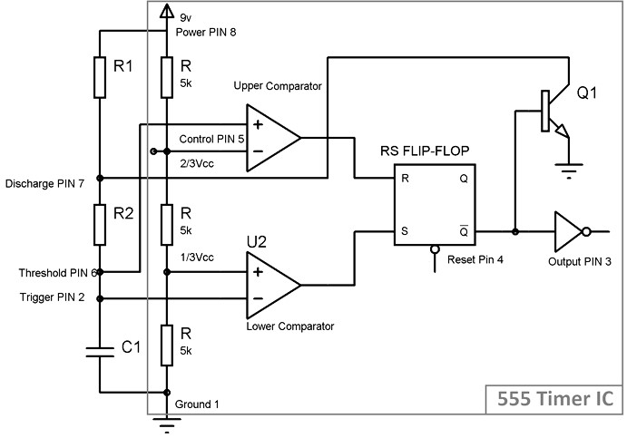
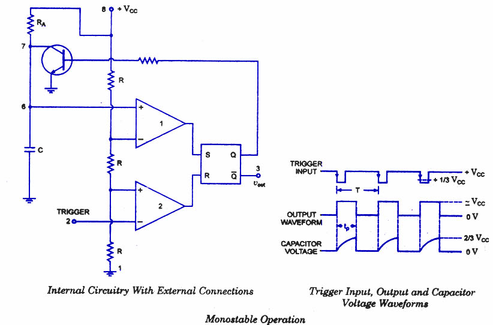
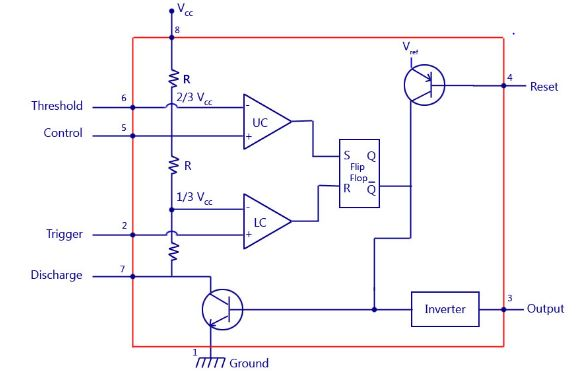

### Introduction
 
The Multivibrator circuits are widely used in electronics. It is the electronics circuit which is used to implement the two state devices like Relaxation Oscillator, Timer and Flip-flops. The two states refers to the two voltage levels of the output. (e.g  0V, and 5V). Many times the two voltage levels are also represented as either logic high (e.g 5V) and logic low. (e.g 0V). 

### 1)Astable multivibrator 

In the 555 Oscillator above, pin 2 and pin 6 are connected together allowing the circuit to retrigger itself on each and every cycle allowing it to operate as a free running oscillator. During each cycle capacitor, C charges up through both timing resistors, R1 and R2 but discharges itself only through resistor, R2 as the other side of R2 is connected to the discharge terminal, pin 7. Then the capacitor charges up to 2/3Vcc (the upper comparator limit) which is determined by the 0.693(R1+R2)C combination and discharges itself down to 1/3Vcc (the lower comparator limit) determined by the 0.693(R2.C) combination. This results in an output waveform whose voltage level is approximately equal to Vcc - 1.5V and whose output "ON" and "OFF" time periods are determined by the capacitor and resistors combinations. The individual times required completing one charge and discharge cycle of the output is therefore given as: 

<b> t1 = 0.693 (R1+R2)C    t2 = 0.693 R2C    T = t1 + t2  Frequency(F) = 1/T  Duty cycle = Ton</b>
  

 

<b>Figure 1. Astable multivibrator </b>

                
### 2)Monostable multivibrator

It has one stable and one quasi stable state. The circuit is useful for generating single output pulse of time duration in response to a triggering signal. The width of the output pulse depends only on external components connected to the op-amp. The diode gives a negative triggering pulse. When the output is +Vsat, a diode clamps the capacitor voltage to 0.7V then, a negative going triggering impulse magnitude Vi passing through RC and the negative triggering pulse is applied to the positive terminal. Let us assume that the circuit is instable state. The output V0i is at +Vsat. The diode D1 conducts and Vc the voltage across the capacitor ‘C’ gets clamped to 0.7V,the voltage at the positive input terminal through R1R2 potentiometer divider is +ßVsat. Now, if a negative trigger of magnitude Vi is applied to the positive terminal so that the effective signal is less than 0.7V.the output of the Op-Amp will switch from +Vsat to –Vsat. The diode will now get reverse biased and the capacitor starts charging exponentially to –Vsat. When the capacitor charge Vc becomes slightly more negative than –ßVsat, the output of the op-amp switches back to +Vsat. The capacitor ‘C’ now starts charging to +Vsat through R until Vc is 0.7V.             

<b>  V0 = Vf + (Vi-Vf) 𝑒𝑡/𝑅𝐶 ,  ß = R2/(R1+R2)  
If Vsat >> Vp and R1=R2 and ß = 0.5,  
Then, T = 0.69RC </b>
  
The circuit diagram of a monostable multivibrator is shown below.  

 

<b>Figure 2. Monostable multivibrator </b>

### Schematic Diagram Of IC 555 

 

<b>Figure 3. Schematic Diagram Of IC 555  </b>
